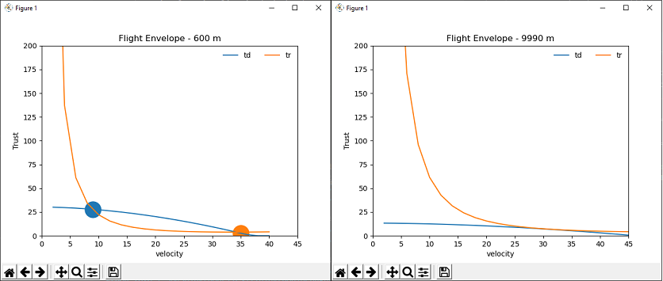
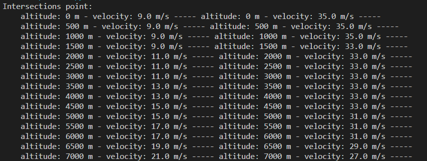

# flightEnvelope
A python program to calculate the aerodynamic envelope with its intersections, futhermore its min and max velocities, according to altitude.

- features
  - plot graph
  - caculte at a altitude
  - calculate multiple altitudes with a step
  - save all outputs in txt files.
  - linearization after the calculation to fiz the gaps of velocities. Both values are saved in individuals files.







### How to Use it ?

Add three txt files inside data, each one being:

* velocities.txt
* Pe.txt
* Nh.txt

They will contain the data according to the velocities in the first file. 

**Note:** Remenber not adding the group of velocities with 0 m/s.

<br>

In the end you just need to work with two mainly functions to plot data, besides other configurations like step and interactions or debug when feel needed:


```python
#envelope.find_envelope_all(plot=True)
envelope.find_envelope(alt=600, plot=True)
```

### Where can it be catch besides the console?

The data is saves in *data/* with the min and max velocities with each one a file. 

**Adition:** The altitudes in *data/output_altitudes.txt* are also saved in case of future need.

```
📂data
 ┣ 📜max_velocities.txt
 ┣ 📜max_velocities_linearized.txt
 ┣ 📜min_velocities.txt
 ┣ 📜min_velocities_linearized.txt
 ┣ 📜Nh.txt
 ┣ 📜output_altitudes.txt
 ┣ 📜Pe.txt
 ┗ 📜velocities.txt
```

### Files Infrastruct

```
flightEnvelope
┣ 📂src
┃ ┣ 📂classes
┃ ┣ 📂data
┃ ┣ 📂driver
┃ ┣ 📂functions
┃ ┣ 📂model
┣ dependencies.py
┗ main.py
```

### Updates and encouragements?

* plot data with Pandas visualization
* make a 3d map using the all the plots


